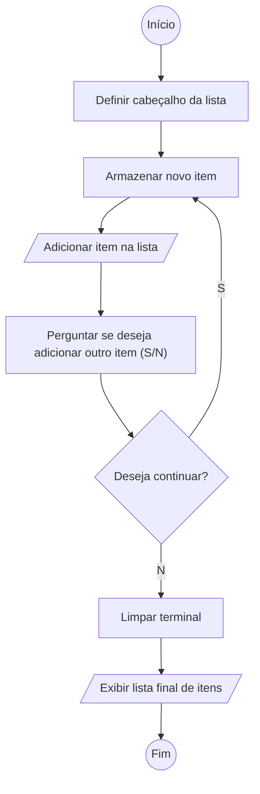

# Problema

Permitir que o usuário adicione dinamicamente uma lista de itens, continuando ou encerrando o processo conforme sua escolha.

**Como** usuário da aplicação, **quero** inserir itens manualmente em uma lista, escolhendo quando parar,  **para** que eu possa montar uma lista personalizada conforme minha necessidade.

## Critérios de aceite

1.	A aplicacão deve exibir um cabeçalho inicial “LISTA DE ITENS”.

2.	A aplicacão deve solicitar a descrição de cada novo item.

3.	A aplicacão deve armazenar todos os itens inseridos.

4.	Após cada item, o aplicacão deve perguntar se o usuário deseja continuar adicionando itens.

5.	A usuário deve poder responder:
- `s` para continuar
- `n` para encerrar

6. Ao encerrar, o aplicacão deve limpar as mensagens do terminal.

7.	A aplicacão deve exibir a lista completa dos itens cadastrados.

## Casos de teste

| Caso | Entrada | Ação esperada | Saída |
| --- | --- | --- | --- | 
| Inserção contínua de itens |`banana`, `s`, `maçã`, `s`, `pêra`, `n` | Armazenar 3 itens e encerrar | `banana`, `maçã`, `pêra` |
| Encerramento imediato | `abacaxi`, `n` | Armazenar apenas 1 item | `abacaxi` |

## Solução

## Sugestões de ferramentas

| Ferramentas | Endereço eletrônico |
| --- | --- | 
| Figma | https://www.figma.com/ | 
| Miro | https://miro.com/ | 
| Lucidchart | https://www.lucidchart.com/pages/pt |
| Draw | https://www.drawio.com/ |
| Visual Paradigm | https://www.visual-paradigm.com/ |