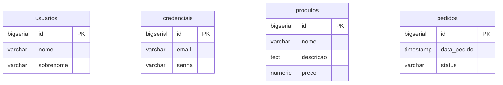
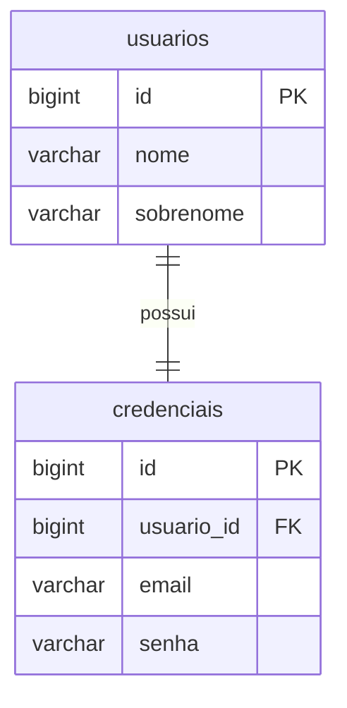
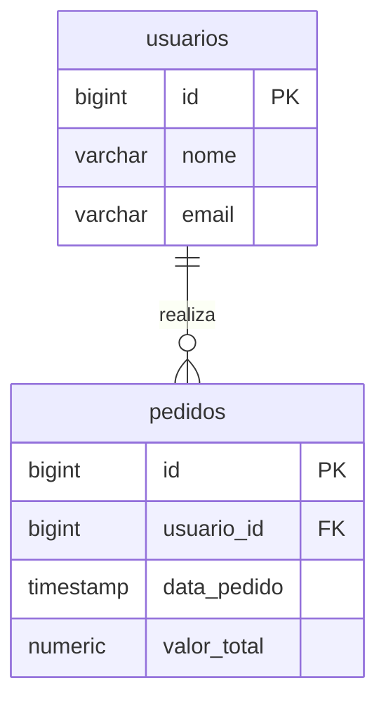
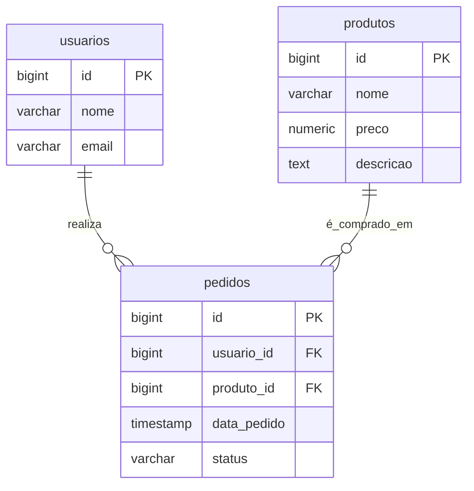
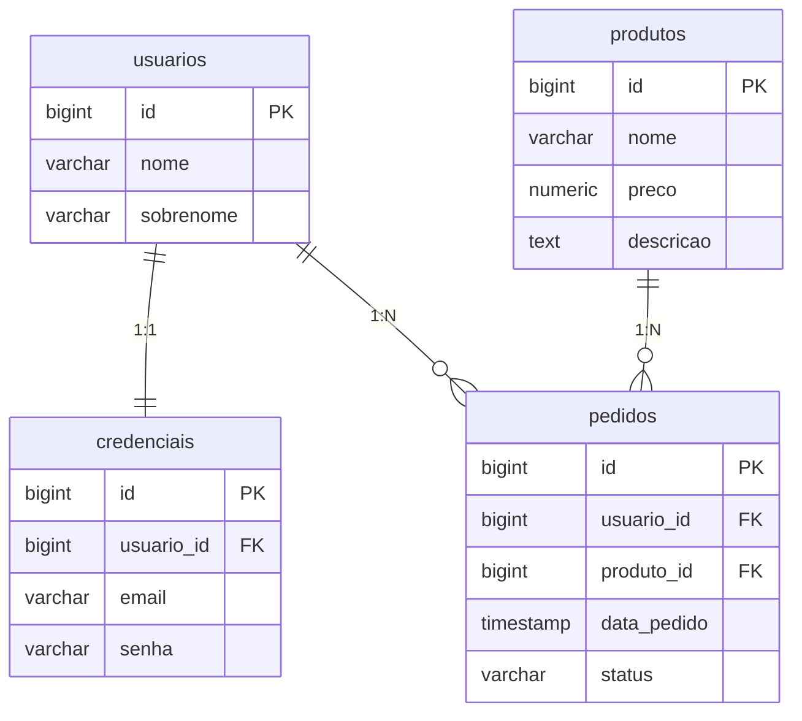
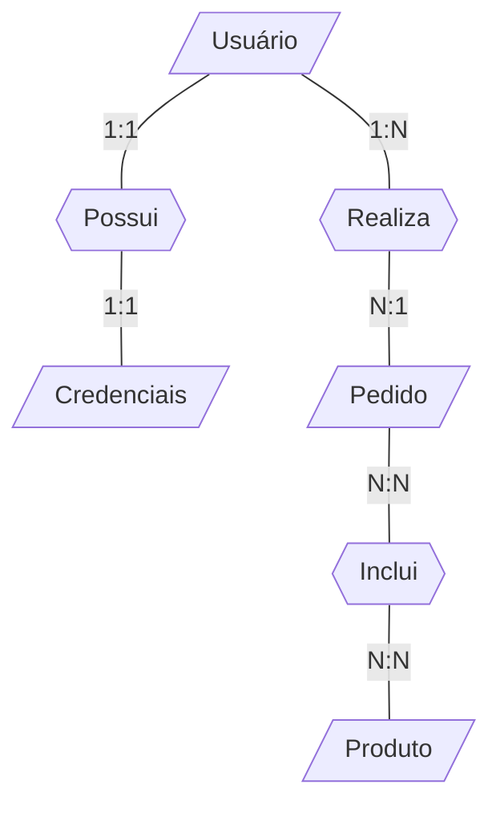
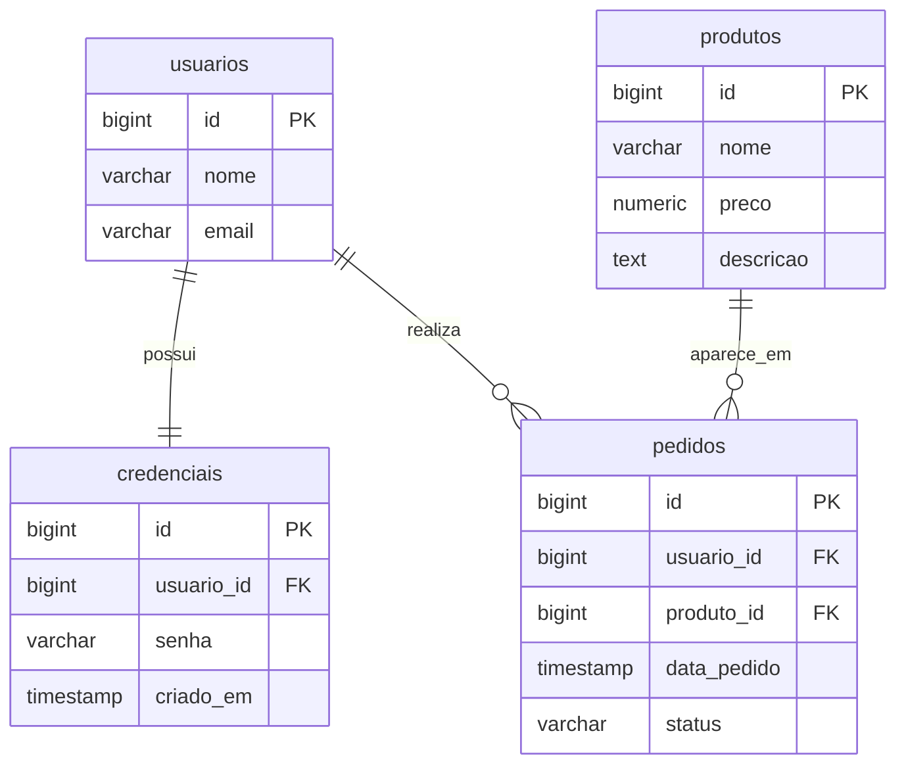

# Modelagem de Dados

Modelagem de dados é o processo de estruturar informações do mundo real de forma organizada e consistente para:

- Reduzir redundância;
- Melhorar performance;
- Garantir integridade;
- Facilitar manutenção;
- Permitir evolução do sistema.

> 💡 Em projetos reais, grande parte dos problemas de software vem de uma modelagem mal planejada.

## Modelo Relacional

Em modelos relacionais, utilizamos quatro princípios fundamentais para organizar e preservar as informações dentro de um banco de dados. São eles:
	
- O agrupamento dos dados em entidades, que representam os objetos ou conceitos do mundo real sobre os quais desejamos armazenar informações.
- A definição de atributos, que descrevem as características específicas de cada entidade.
- A aplicação de regras de integridade, que garantem consistência, validade e confiabilidade dos dados armazenados.
- O estabelecimento de relacionamentos, que permitem combinar informações e representar como as entidades se conectam entre si.

Esses princípios formam a base do modelo relacional e asseguram que os dados sejam estruturados de forma lógica, organizada e segura.

### Entidade

Entidades são objetos do mundo real que queremos representar dentro de um banco de dados. No contexto de modelagem de dados, uma entidade é tudo aquilo sobre o qual você precisa armazenar informações.

**Conceitual**


**Código fonte**

```postgresql
create table usuarios ();
create table credencias ();
create table produtos ();
create table pedidos ();
```

### Atributo

Atributos são os dados que representam as características que queremos armazenar de uma entidade.

**Conceitual**



**Código fonte**

```postgresql
create table usuarios (
    id bigserial primary key,
    nome varchar(120) not null,
    sobrenome varchar(120) not null
);

create table credenciais (
    id bigserial primary key,
    email varchar(255) not null,
    senha varchar(255) not null
);

create table produtos (
    id bigserial primary key,
    nome varchar(150) not null,
    descricao text,
    preco numeric(10, 2) not null
);

create table pedidos (
    id bigserial primary key,
    data_pedido timestamp default now(),
    status varchar(40) not null
);
```

Ou, caso queira adicionar atributos a uma entidade ou tabela existente:

```postgresql
alter table usuarios add column id bigserial primary key;
alter table usuarios add column nome varchar(120) not null;
alter table usuarios add column sobrenome varchar(120) not null;

alter table credenciais add column id bigserial primary key;
alter table credenciais add column email varchar(255) not null;
alter table credenciais add column senha varchar(255) not null;

alter table produtos add column nome varchar(150) not null;
alter table produtos add column descricao text;
alter table produtos add column numeric(10, 2) not null;

alter table pedidos add column id bigserial primary key;
alter table pedidos add column data_pedido timestamp default now();
alter table pedidos add column status varchar(40) not null;
```

### Relacionamento

Relacionamento é a maneira como duas ou mais entidades, ou tabelas, se conectam dentro de um banco de dados, permitindo vincular informações entre elas de forma lógica. Essa conexão evita duplicidade de dados, mantém a consistência das informações e possibilita combinar registros para responder perguntas mais complexas.

#### Um para Um

**Conteitual**



#### Um para Muitos

**Conceitual**



#### Muitos para Muitos

**Conceitual**



### Integridade

#### Chave Primária

Uma `primary key` é uma chave primária que serve como identificador único para cada registro em uma entidade ou tabela. 

```postgresql
id bigserial primary key
```

#### Chave Estrangeira

Uma `foreign key` é uma chave estrangeira que permite associar dados entre entidades ou tabelas. A partir de uma chave estrangeira, uma tabela pode obter os dados armazenados em outra tabela utilizando a chave primária do registro como referência.

```postgresql
usuario_id foreign key
usuario_id bigint references usuarios(id)
```

#### Restrições

| `Constraint` | Descrição | 
| --- | --- |
| `primary key` | Define um identificador único de uma entidade ou tabela. |
| `foreign key` | Define uma referência para um identificador único de outra entidade ou tabela. |
| `unique` | Define que o valor registrado não pode ser repetir. |
| `not null` | Define que um valor deve ser registrado obrigatóriamente. |
| `check` | Refine regras de verificação. |

### Diagramas

#### Conceitual



#### Lógico



### <center>----- ou -----</center>



#### Código-fonte

```postgresql
create table usuarios (
    id bigserial primary key,
    nome varchar(120) not null,
    sobrenome varchar(120) not null
);

create table credenciais (
    id bigserial primary key,
    usuario_id bigint not null references usuarios(id),
    email varchar(120) not null
    senha varchar(120) not null
);

create table produtos (
    id bigserial primary key,
    nome varchar(200) not null,
    preco numeric(10,2) not null,
    descricao text
);

create table pedidos (
    id bigserial primary key,
    usuario_id bigint not null references usuarios(id),
    produto_id bigint not null references produtos(id),
    data_pedido timestamp default now(),
    status varchar(40) not null
);
```
